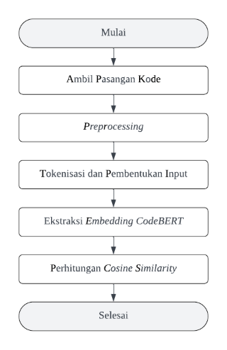
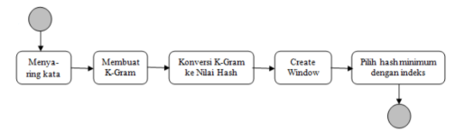

**ANALISIS KEMIRIPAN *SOURCE* *CODE PROJECT* MENGGUNAKAN METODE *CODEBERT* DAN *WINNOWING ALGORITHM***

**PROPOSAL SKRIPSI**

## **B. Rumusan Masalah**
Berdasarkan latar belakang yang telah diuraikan, maka permasalahan yang akan dikaji dalam penelitian ini dirumuskan sebagai berikut:

1. Bagaimana penerapan *CodeBERT* dan *Winnowing Algorithm* dalam mendeteksi kemiripan kode sumber, baik secara semantik maupun tekstual pada *Source Code* *Project* mahasiswa Program Studi Informatika Fakultas Teknik Universitas Muhammadiyah Makassar?
1. Bagaimana proses integrasi fitur analisis kemiripan kode berbasis *CodeBERT* dan *Winnowing Algorithm* ke dalam sistem pengumpulan tugas *Capstone Project* mahasiswa Program Studi Informatika Fakultas Teknik Universitas Muhammadiyah Makassar?

## **C. Tujuan Penelitian**
Berdasarkan rumusan masalah di atas, penelitian ini bertujuan untuk:

1. Mengimplementasikan kombinasi metode *CodeBERT* dan *Winnowing Algorithm* untuk mendeteksi kemiripan kode sumber secara semantik dan tekstual pada *Source Code Project* mahasiswa Program Studi Informatika Fakultas Teknik Universitas Muhammadiyah Makassar.  
1. Mengintegrasikan fitur analisis kemiripan kode berbasis *CodeBERT* dan *Winnowing Algorithm* ke dalam sistem pengumpulan tugas *Capstone Project* mahasiswa Program Studi Informatika Fakultas Teknik Universitas Muhammadiyah Makassar.

## **D. Manfaat Penelitian**
Adapun manfaat dari penelitian ini adalah sebagai berikut:

1. Bagi Pengelola Platform Manajemen Proyek 

   Menyediakan fitur pendeteksi kemiripan kode sumber pada sistem *Capstone Project* Program Studi Informatika Fakultas Teknik Universitas Muhammadiyah Makassar, sehingga dapat mengurangi beban verifikasi manual dan meningkatkan objektivitas penilaian keaslian kode antar proyek mahasiswa.

1. Bagi Pengembang

   Mendorong mahasiswa pengembang untuk menghasilkan kode sumber yang lebih orisinal dan mengurangi kecenderungan melakukan *copy-paste* dari proyek sebelumnya atau repositori publik, karena adanya sistem yang mampu memeriksa kemiripan kode.

1. Bagi Peneliti Lain

   Menjadi referensi penerapan kombinasi metode antara model *Transformer* dan algoritma *fingerprinting* dalam konteks deteksi *plagiarisme* kode sumber yang terintegrasi dengan platform manajemen proyek berbasis web.

## **E. Ruang Lingkup Penelitian**
Agar penelitian ini lebih terfokus dan terarah, ruang lingkupnya dibatasi sebagai berikut:

1. Data yang digunakan berupa kode sumber tugas *Capstone Project* mahasiswa Program Studi Informatika Fakultas Teknik Universitas Muhammadiyah Makassar yang tersimpan pada sistem pengelolaan tugas *Capstone Project*. 
1. Metode yang digunakan adalah kombinasi algoritma *Winnowing* dan *CodeBERT*. *CodeBERT* diposisikan sebagai metode untuk mengukur kemiripan semantik kode sumber melalui *embedding* vektor, sedangkan *Winnowing Algorithm* berperan sebagai metode untuk mengukur kemiripan tekstual berdasarkan *fingerprint* k-gram yang mewakili pendekatan deteksi *plagiarisme* klasik.
1. Penelitian berfokus pada perancangan, implementasi, dan integrasi modul deteksi kemiripan kode tersebut ke dalam sistem pengumpulan tugas *Capstone Project* yang telah berjalan, serta pada analisis hasil skor kemiripan dan kategori indikasi yang ditentukan.
1. Implementasi dan pengujian sistem dilakukan pada Laboratorium Komputer Program Studi Informatika Fakultas Teknik Universitas Muhammadiyah Makassar sebagai studi kasus metode yang diusulkan.

## **A. Landasan Teori**
### **1. *Capstone Project***
*Capstone Project* merupakan tugas akhir berbasis proyek yang dirancang sebagai pengalaman puncak bagi mahasiswa untuk mengintegrasikan pengetahuan dan keterampilan yang telah dipelajari selama perkuliahan dalam bentuk solusi nyata terhadap suatu permasalahan. Dalam konteks rekayasa perangkat lunak, *Capstone Project* umumnya mengharuskan mahasiswa merancang, mengimplementasikan, dan mendemonstrasikan produk perangkat lunak yang siap digunakan oleh pengguna atau klien tertentu (NU Editorial Contributors, 2023).

Pada Program Studi Informatika Fakultas Teknik Universitas Muhammadiyah Makassar, *Capstone Project* dijadikan salah satu tugas berbobot SKS di mana mahasiswa diwajibkan mengembangkan dan mengumpulkan produk perangkat lunak melalui sistem pengelolaan berbasis web yang terintegrasi dengan repositori *GitHub*.

Gambar 2 *Flowchart* Analisis *CodeBERT* (Feng et al., 2020)

Gambar 2 menggambarkan tahapan analisis kemiripan semantik menggunakan *CodeBERT* pada penelitian ini yang disusun dengan mengadaptasi alur pemanfaatan *CodeBERT* sebagai *ekstraktor embedding* dan perhitungan *cosine similarity* yang dijelaskan oleh Feng et al. (2020) dan Akbar dkk. (2025). Tahapan tersebut dijelaskan sebagai berikut:

1. Ambil pasangan kode

   Pasangan kode sumber proyek diambil dari sistem *Capstone Project* sebagai masukan awal proses analisis kemiripan.

1. *Preprocessing* kode

   Kode sumber dinormalisasi dengan menghapus komentar, *whitespace* berlebih, dan karakter tidak signifikan agar lebih konsisten sebelum dianalisis lebih lanjut.

1. Tokenisasi dan pembentukan *input*

   Kode yang telah diproses diubah menjadi deret token dan diformat ke dalam struktur *input* yang sesuai dengan model *CodeBERT*.

1. Ekstraksi *embedding* dengan *CodeBERT*

   Model *CodeBERT* mengekstraksi vektor *embedding* berdimensi tinggi dari masing‑masing potongan kode untuk merepresentasikan makna semantiknya.

1. Perhitungan *cosine similarity*

   Vektor *embedding* dari dua potongan kode dibandingkan menggunakan *cosine similarity* sehingga dihasilkan skor kemiripan semantik yang menjadi keluaran jalur analisis ini sebelum digabungkan dengan skor *Winnowing* pada perhitungan skor gabungan.

### **5. Algoritma *Winnowing***

Gambar 3 *Flowchart* Algoritma *Winnowing* (Sugiono et al., 2018)

Gambar 3 memperlihatkan alur kerja algoritma *Winnowing* dari Sugiono et al. (2018). Tahapan tersebut dijelaskan sebagai berikut:

1. Menyaring kata

   Kode dinormalisasi dengan menghapus karakter tidak signifikan, tanda baca, dan *whitespace* berlebih, serta mengubah seluruh teks menjadi huruf kecil.

1. Membuat *k-gram*

   Teks yang telah dinormalisasi dipecah menjadi rangkaian *k-gram* karakter yang *overlapping* berdasarkan nilai *k* yang ditentukan.

1. Konversi ke nilai *Hash*

   Setiap *k-gram* dikonversi menjadi nilai *hash* menggunakan fungsi *rolling hash*, sehingga diperoleh deret nilai *hash* dengan jumlah yang sama dengan banyaknya *k-gram*.

1. Pembentukan *window*

   Deret nilai *hash* dibagi ke dalam kelompok *window* berukuran *w*, di mana *window* pertama berisi nilai *hash* ke-1 hingga ke-*w*, *window* kedua berisi nilai *hash* ke-2 hingga ke-(*w*+1), dan seterusnya, sehingga seluruh bagian dokumen terwakili.

1. Pemilihan *fingerprint*

   Dari setiap *window* dipilih nilai *hash* minimum sebagai *fingerprint*. Apabila terdapat lebih dari satu nilai *hash* minimum yang bernilai sama, dipilih nilai *hash* yang posisinya paling kanan *(rightmost)*. Seluruh nilai *hash* terpilih dari semua *window* dikumpulkan sebagai himpunan *fingerprint* dokumen (Schleimer S et al., 2003).

Dalam penelitian ini, algoritma *Winnowing* menggunakan parameter sebagai berikut:

1. Panjang *k-gram*

   Panjang *k-gram (k)* sebesar 5 karakter. Nilai ini mengikuti spesifikasi dari Schleimer et al. (2003) yang menunjukkan bahwa k = 5 memberikan keseimbangan optimal antara sensitivitas deteksi dan efisiensi komputasi untuk dokumen *fingerprinting*.

1. Ukuran *window*

   Ukuran *window* *(w)* yang digunakan pada tahap pemilihan *fingerprint* ditetapkan sebesar 4. Nilai ini mengacu pada implementasi yang digunakan oleh Ramli et al. (2021) dan Sugiono et al. (2018) dalam pendeteksian *plagiarisme* kode dan dokumen teks berbasis algoritma *Winnowing*.

### **6. Penggabungan Metode**
Pendekatan kombinasi dalam deteksi *plagiarisme* menggabungkan lebih dari satu metode atau jenis analisis dalam satu kerangka sistem, sehingga kelemahan masing-masing metode dapat saling ditutupi. Pada konteks kode sumber, metode berbasis *fingerprinting* seperti *Winnowing* cenderung sensitif terhadap *copy-paste* langsung dan efektif untuk kasus di mana kode disalin dengan perubahan minimal pada tingkat teks. Namun, *Winnowing* tidak mampu mendeteksi kemiripan logika program yang disamarkan melalui penggantian nama variabel atau *refactoring* struktural. Sebaliknya, metode berbasis *embedding Transformer* seperti *CodeBERT* lebih mampu mengenali kesamaan pada tingkat semantik, tetapi tidak secara eksplisit menunjukkan bagian teks mana yang disalin dan kurang konsisten untuk *snippet* kode yang sangat pendek. 

Dalam penelitian ini, penggabungan *CodeBERT* dan *Winnowing* diwujudkan melalui mekanisme *score-level fusion*, di mana masing-masing metode menghasilkan skor kemiripan secara independen. Skor semantik dari *CodeBERT* dan skor tekstual dari *Winnowing* kemudian dikombinasikan melalui formula agregasi berbobot untuk menghasilkan skor gabungan serta kategori indikasi kemiripan yang telah ditentukan pada tahap perancangan sistem.

Gambar 5 *Flowchart* Perancangan Sistem

Alur kerja sistem secara keseluruhan berjalan melalui tahapan berikut:

1. Pengambilan Data

   Sistem mengambil data kode sumber *Capstone Project* mahasiswa dari basis data dan repositori *GitHub* yang telah terintegrasi dengan sistem.

1. Analisis Paralel:

   Kode sumber dianalisis secara paralel menggunakan dua pendekatan yang berbeda.

2. Analisis Semantik *CodeBERT*

   Kode sumber yang telah diproses dikirim ke *Similarity Service* untuk diekstraksi menjadi vektor *embedding* menggunakan model *CodeBERT*. Kemiripan semantik antara dua proyek dihitung menggunakan *cosine similarity* untuk menghasilkan skor semantik. Secara matematis, skor kemiripan semantik *CodeBERT* dirumuskan sebagai

   |SCB=A∙BA B|(1)|
   | - | - |

   dengan keterangan:

1) SCB : skor kemiripan semantic dari *CodeBERT*
1) A : vektor *embedding* yang dihasilkan *CodeBERT* untuk kode proyek

pertama

1) B : vektor *embedding* yang dihasilkan *CodeBERT* untuk kode proyek

kedua

1) A∙B : hasil perkalian *dot product* antara vektor *A* dan *B*
1) A : *norm* (panjang) vektor *embedding* *A*
1) B : *norm* (panjang) vektor *embedding* *B*

2. Analisis Tekstual *Winnowing*

   Secara paralel, kode sumber diproses dengan algoritma *Winnowing* melalui tahapan pembentukan *k-gram*, perhitungan *rolling hash*, *sliding window*, dan pemilihan *fingerprint*. Setelah diperoleh himpunan *fingerprint* untuk setiap berkas kode, skor kemiripan tekstual antar dua proyek dihitung menggunakan indeks *Jaccard*. Indeks ini membandingkan proporsi *fingerprint* yang sama terhadap keseluruhan *fingerprint* yang muncul pada kedua proyek, sehingga menghasilkan nilai kemiripan pada rentang 0 sampai 1. Dalam penelitian ini, skor kemiripan tekstual  didefinisikan menggunakan indeks *Jaccard* atas himpunan *fingerprint* hasil algoritma *Winnowing*. Secara matematis, indeks *Jaccard* dirumuskan sebagai

   |SW=|A∩B||A∪B||(2)|
   | - | - |

   dengan keterangan:

1) SW : skor kemiripan tekstual dari *Winnowing*
1) A : himpunan *fingerprint* dari proyek pertama
1) B : himpunan *fingerprint* dari proyek kedua
1) |A∩B| : irisan himpunan *fingerprint* yang sama pada kedua proyek
1) |A∩B| : gabungan seluruh *fingerprint* dari kedua proyek
1. Perhitungan skor gabungan

   Skor semantik dan skor tekstual digabungkan menggunakan formula *weighted average* untuk menghasilkan skor gabungan.

1. Klasifikasi Kategori

   Berdasarkan nilai skor semantik, skor tekstual, dan skor gabungan, sistem mengklasifikasikan pasangan proyek ke dalam kategori indikasi kemiripan secara berurutan berdasarkan prioritas. Kategori yang kondisinya terpenuhi terlebih dahulu akan dipilih, sehingga hasil klasifikasi tetap konsisten dengan Tabel 3. 

1. Penyimpanan dan Tampilan

   Hasil analisis disimpan ke dalam basis data sistem dan dapat diakses kembali melalui antarmuka *dashboard* yang tersedia pada sistem *Capstone Project*. Sistem menyediakan dua tingkat tampilan sesuai dengan peran pengguna:

1. Tampilan Dosen Penguji

   Dosen penguji dapat melihat hasil analisis secara lengkap, mencakup skor kemiripan dari kedua metode secara terpisah, yaitu skor kemiripan semantik dari *CodeBERT* dan skor kemiripan tekstual dari *Winnowing*, serta skor gabungan akhir dan kategori indikasi kemiripan. Selain itu, dosen penguji dapat melihat kumpulan potongan kode *(code snippets)* yang teridentifikasi memiliki kemiripan tinggi sebagai bukti pendukung. Kumpulan bukti ini dapat terdiri atas lebih dari satu potongan kode, baik dari file yang sama maupun dari file yang berbeda, sehingga penilaian dapat didasarkan pada seluruh jejak kemiripan yang ditemukan sistem.

1. Tampilan Mahasiswa

   Mahasiswa dapat melihat ringkasan hasil analisis berupa skor gabungan akhir dan kategori indikasi kemiripan pada proyek miliknya, beserta potongan kode yang terdeteksi mirip. Jika terdapat lebih dari satu kemiripan pada file atau blok yang berbeda, sistem menampilkan seluruh potongan kode yang relevan agar mahasiswa dapat memahami sumber kemiripan secara lebih utuh.

## **D. Penetapan *Threshold* dan Skor gabungan**
Skor kemiripan yang dihasilkan oleh *CodeBERT*, *Winnowing*, maupun skor gabungan didefinisikan pada skala 0–1, atau dinyatakan dalam rentang 0%–100% apabila disajikan dalam bentuk persentase. Nilai skor tidak diperkenankan melebihi 1; apabila proses perhitungan awal menghasilkan nilai di atas 1 akibat fungsi agregasi, maka dilakukan normalisasi sehingga nilai akhir tetap berada pada rentang 0–1 sebelum digunakan untuk proses klasifikasi.

1\. *Threshold* Kemiripan Semantik *CodeBERT*

Ambang kemiripan semantik untuk komponen *CodeBERT* ditetapkan pada nilai 0,80 (80%). Penetapan nilai ini mengacu pada penelitian Akbar dkk. (2025) yang memanfaatkan *CodeBERT* dalam arsitektur *Siamese Network* untuk mendeteksi *plagiarisme* kode sumber, di mana *threshold cosine similarity* sebesar 0,80 dilaporkan efektif memisahkan pasangan kode yang tergolong *plagiarisme* dari yang tidak, dengan akurasi sistem mencapai sekitar 96,4%.

Nilai ambang ini akan dikalibrasi kembali melalui eksperimen awal  terhadap distribusi skor pada data *Capstone Project* dengan karakteristik kode mahasiswa Program Studi Informatika Fakultas Teknik Universitas Muhammadiyah Makassar.

2\.  *Threshold* Kemiripan Tekstual *Winnowing*

Ambang kemiripan tekstual untuk komponen *Winnowing* ditetapkan pada nilai 0,75. Penetapan ini berdasarkan temuan Ramli et al. (2021) yang melaporkan rata-rata tingkat kemiripan sekitar 75,12% pada sampel kode mahasiswa yang memiliki indikasi kemiripan kuat, dengan distribusi persentase kemiripan umumnya berada pada kisaran 70-80% untuk kasus-kasus *plagiarisme* yang teridentifikasi.

Nilai 0,75 dipilih sebagai titik tengah dari rentang yang dilaporkan dan akan berfungsi sebagai nilai ambang awal. Nilai ini akan dikalibrasi kembali melalui eksperimen pada data *Capstone Project* dengan karakteristik kode mahasiswa Program Studi Informatika Fakultas Teknik Universitas Muhammadiyah Makassar. 

3\. Perhitungan Skor gabungan

Skor gabungan (SG) dirancang untuk menggabungkan skor semantik *CodeBERT* (SCB) dan skor tekstual *Winnowing* (SW) melalui *weighted average*. Formula skor gabungan dinyatakan sebagai:

|SG=a∙SCB+(1-a)∙SW|(3)|
| - | -: |

dengan keterangan:

1. SG : skor kemiripan gabungan
1. SCB : skor kemiripan semantik dari *CodeBERT*
1. SW : skor kemiripan tekstual dari *Winnowing*
1. a : bobot skor

Hingga saat ini, belum terdapat penelitian yang secara spesifik mengombinasikan *CodeBERT* dan *Winnowing* untuk deteksi *plagiarisme* kode sumber dengan penetapan bobot tertentu. Oleh karena itu, penetapan nilai *α*  dilakukan melalui pendekatan berikut:

1) Analisis Karakteristik Domain

   Berdasarkan kajian literatur oleh Zakeri et al. (2023), teknik *plagiarisme* kode modern cenderung melibatkan transformasi semantik seperti *refactoring*, *variable renaming*, dan *code restructuring* yang mengubah representasi tekstual namun mempertahankan logika program. Oleh karena itu, komponen semantik perlu diberi bobot lebih tinggi untuk meningkatkan sensitivitas terhadap kasus-kasus tersebut.

1) Pertimbangan Performa Komponen Individual

   Akbar dkk. (2025) melaporkan bahwa *CodeBERT* mencapai akurasi 96,4% dalam mendeteksi *plagiarisme* kode sumber, menunjukkan kemampuan diskriminasi yang sangat baik pada komponen semantik. Sementara itu, *Winnowing* efektif untuk deteksi kemiripan tekstual dengan rata-rata *similarity* 75,12% pada kasus *copy-paste* (Ramli et al., 2021).

1) Keseimbangan Komplementaritas

   Meskipun komponen semantik diberi prioritas, komponen tekstual tetap penting untuk mendeteksi *plagiarisme* literal dan menyediakan bukti konkret yang dapat ditunjukkan kepada pengguna sistem (Virginia & Alamsyah, 2026).

4\. Klasifikasi Kategori

Berdasarkan kombinasi nilai skor semantik (SCB), skor tekstual (SW), dan skor gabungan (SG),  sistem mengklasifikasikan setiap pasangan proyek ke dalam empat kategori indikasi kemiripan. Jika SCB≥0,80 dan SW≥0,75, hasilnya ditetapkan sebagai *Plagiarisme Kuat* sebagai kategori dengan prioritas tertinggi. Klasifikasi dilakukan secara berurutan berdasarkan prioritas, di mana kategori yang kondisinya terpenuhi terlebih dahulu akan dipilih, sehingga hasil klasifikasi tetap konsisten dengan Tabel 3 dan tidak bergantung pada jumlah potongan kode yang ditemukan. Aturan klasifikasi ditunjukkan pada Tabel 3 berikut :

Tabel 3 Aturan Klasifikasi Kategori Kemiripan

|**No**|**Kategori**|**Kondisi**|
| :-: | :-: | :-: |
|1|*Plagiarisme* Kuat|SCB≥0,80  &&  SW≥0,75|
|2|Mirip Tekstual|SCB<0,80 && SW≥0,75|
|3|Mirip Semantik|SCB≥0,80 && SW<0,75|
|4|Normal|SCB<0,80  &&  SW<0,75|

## **E. Pengujian Sistem**
Pengujian sistem dilakukan untuk memvalidasi dua hal sesuai rumusan masalah penelitian, yaitu penerapan *CodeBERT* dan *Winnowing Algorithm* dalam mendeteksi kemiripan kode sumber secara semantik dan tekstual, serta keberhasilan integrasi fitur analisis kemiripan ke dalam sistem pengumpulan tugas *Capstone Project*. Pengujian dilakukan menggunakan metode *black box testing*, yaitu pengujian yang berfokus pada validasi *input* dan *output* sistem tanpa memeriksa struktur internal kode program.

Pengujian mencakup dua bagian utama, yaitu pengujian fungsional pada layanan analisis kemiripan dan pengujian fungsional pada antarmuka sistem.

1. Pengujian analisis kemiripan

   Pengujian ini dilakukan untuk menjawab rumusan masalah pertama, yaitu memverifikasi bahwa *CodeBERT* mampu menghasilkan skor kemiripan semantik dan *Winnowing Algorithm* mampu menghasilkan skor kemiripan tekstual secara akurat untuk setiap pasangan kode yang dianalisis. Pengujian mencakup skenario analisis dua potongan kode secara langsung, analisis satu proyek terhadap proyek lain, analisis *batch* seluruh proyek sekaligus, serta pengujian ketersediaan layanan. Pada tahap ini juga diuji bahwa sistem dapat mengembalikan lebih dari satu potongan kode jika kemiripan ditemukan pada beberapa file atau blok kode yang berbeda.

2. Pengujian antarmuka sistem

   Pengujian antarmuka dilakukan untuk menjawab rumusan masalah kedua, yaitu memastikan bahwa fitur analisis kemiripan telah berhasil diintegrasikan ke dalam sistem *Capstone Project*. Pengujian ini memverifikasi bahwa *dashboard* dosen dan mahasiswa menampilkan hasil analisis secara benar, mencakup skor kemiripan semantik, skor kemiripan tekstual, skor gabungan, kategori indikasi kemiripan, serta kumpulan potongan kode yang terdeteksi mirip.

Tabel 4 Rencana Pengujian *Black Box Testing*

|**No**|**Skenario Uji**|**Data Masukan**|**Hasil yang Diharapkan**|
| :-: | :-: | :-: | :-: |
|1|Ketersediaan layanan analisis kemiripan|Permintaan pengecekan status layanan|Layanan aktif dan merespons dengan normal|
|2|Analisis dua kode identik|Dua potongan kode yang sama persis|Indikasi kategori *Plagiarisme Kuat* dan minimal satu kumpulan snippet mirip tampil|
|3|Analisis kode dengan perubahan nama variabel|Dua kode dengan logika sama namun nama variabel berbeda|Indikasi kategori *Mirip Semantik*|
|4|Analisis kode dengan perubahan komentar|Dua kode dengan struktur teks hampir identik|Indikasi kategori *Mirip Tekstual*|
|5|Analisis kode yang benar-benar berbeda|Dua kode yang tidak memiliki keterkaitan|Indikasi kategori *Normal*|
|6|Penanganan *input* kosong|Kode sumber tidak diisi|Sistem mengembalikan pesan kesalahan|
|7|Penanganan data masukan tidak valid|Data masukan bukan kode sumber yang valid|Sistem mengembalikan pesan kesalahan|
|8|Analisis proyek via repositori *GitHub*|Repositori *GitHub* proyek mahasiswa yang valid|Skor, kategori, dan kumpulan potongan kode dikembalikan|
|9|Analisis *batch* seluruh proyek|Kumpulan seluruh repositori *GitHub* proyek mahasiswa|Seluruh pasangan proyek terhitung dan hasil tersimpan di sistem|
|10|Tampilan hasil analisis pada *dashboard* dosen|*Login* sebagai dosen, buka halaman analisis kemiripan|Skor, kategori indikasi, dan kumpulan potongan kode mirip tampil dengan benar|
|11|Tampilan hasil analisis pada *dashboard* mahasiswa|*Login* sebagai mahasiswa, buka halaman analisis kemiripan|Skor, kategori indikasi, dan kumpulan potongan kode mirip tampil dengan benar|

### **F. Hasil *Black Box Testing* (Data Aktual)**

Hasil pengujian pada bagian ini menggunakan snapshot data aktual sistem tanggal 10 Mei 2026. Pada saat pengujian, jumlah proyek aktif yang memiliki repositori valid adalah 17 proyek.

Tabel 5 Ringkasan Hasil Pengujian Fungsional

|**No**|**Area Uji**|**Jumlah Skenario**|**Lulus**|**Tidak Lulus**|**Persentase Lulus**|
| :-: | :- | :-: | :-: | :-: | :-: |
|1|Layanan analisis kemiripan|4|4|0|100%|
|2|Analisis kemiripan langsung (*single pair*)|4|4|0|100%|
|3|Analisis *batch* dan konsistensi data|5|5|0|100%|
|4|Integrasi tampilan hasil pada antarmuka|4|4|0|100%|
| |**Total**|**17**|**17**|**0**|**100%**|

Tabel 6 Hasil Uji Ketersediaan Layanan Analisis

|**No**|**Skenario**|**Masukan**|**Keluaran Aktual**|**Status**|
| :-: | :- | :- | :- | :-: |
|1|Cek status layanan analisis|Permintaan status layanan|Layanan merespons normal dan siap menerima permintaan analisis|Lulus|
|2|Analisis semantik langsung|Dua potongan kode sederhana|Skor semantik (*CodeBERT*) berhasil dikembalikan|Lulus|
|3|Analisis tekstual langsung|Dua potongan kode sederhana|Skor tekstual (*Winnowing*) berhasil dikembalikan|Lulus|
|4|Analisis gabungan|Dua potongan kode|Skor gabungan dan kategori berhasil dikembalikan|Lulus|

Tabel 7 Hasil Uji Analisis Kemiripan dan Klasifikasi

|**No**|**Skenario**|**Masukan Uji**|**Ekspektasi**|**Hasil Aktual**|**Status**|
| :-: | :- | :- | :- | :- | :-: |
|1|Kode identik|Dua kode sama|Terindikasi kuat|Skor tinggi dan terklasifikasi risiko tinggi|Lulus|
|2|Perubahan nama variabel|Kode logika sama, nama variabel berbeda|Terdeteksi semantik|Skor semantik tetap tinggi|Lulus|
|3|Kemiripan tekstual dominan|Kode struktur teks mirip|Terdeteksi tekstual|Skor tekstual melewati ambang|Lulus|
|4|Kode berbeda|Dua kode tidak berkaitan|Kategori normal|Tidak melewati ambang kemiripan|Lulus|

Tabel 8 Hasil Uji Analisis *Batch* dan Konsistensi Data

|**No**|**Indikator Verifikasi**|**Nilai Aktual**|**Target**|**Status**|
| :-: | :- | :-: | :-: | :-: |
|1|Jumlah proyek aktif dengan repositori valid|17|>= 2|Lulus|
|2|Jumlah pasangan teoritis nC2|136|Konsisten dengan jumlah proyek|Lulus|
|3|Jumlah baris hasil kemiripan tersimpan|136|Sama dengan pasangan teoritis|Lulus|
|4|Duplikasi pasangan tidak berurutan|0|0|Lulus|
|5|Pasangan proyek dengan diri sendiri|0|0|Lulus|

Tabel 9 Hasil Uji Ambang dan Distribusi Kategori

|**No**|**Metrik**|**Nilai Aktual**|**Interpretasi**|
| :-: | :- | :-: | :- |
|1|Total pasangan dianalisis|136|Seluruh pasangan proyek berhasil dianalisis|
|2|Lolos ambang semantik (SCB >= 0,99)|46|Terdapat indikasi kemiripan semantik pada 46 pasangan|
|3|Lolos ambang tekstual (SW >= 0,13)|46|Terdapat indikasi kemiripan tekstual pada 46 pasangan|
|4|Lolos kedua ambang|16|Kasus prioritas tinggi untuk verifikasi akademik|
|5|Lolos minimal satu ambang|76|Sebanyak 55,88% pasangan terdeteksi indikasi kemiripan|
|6|Kategori Plagiarisme Kuat|16 (11,76%)|Risiko tertinggi, perlu audit prioritas|
|7|Kategori Mirip Semantik|30 (22,06%)|Butuh verifikasi konteks logika program|
|8|Kategori Mirip Tekstual|30 (22,06%)|Butuh verifikasi kemungkinan *copy-paste*|
|9|Kategori Normal|60 (44,12%)|Tidak ada indikasi melewati ambang|

Tabel 10 Hasil Uji Integrasi Antarmuka Sistem

|**No**|**Skenario UI**|**Ekspektasi**|**Hasil Aktual**|**Status**|
| :-: | :- | :- | :- | :-: |
|1|Halaman analisis dosen|Daftar pasangan, skor, kategori tampil|Data skor semantik, tekstual, gabungan, dan kategori tampil|Lulus|
|2|Halaman analisis mahasiswa|Mahasiswa melihat hasil terkait proyek|Hasil kemiripan tampil sesuai data proyek|Lulus|
|3|Detail potongan kode mirip|Snippet pendukung dapat diakses|Potongan kode mirip dapat ditampilkan saat diminta|Lulus|
|4|Sinkronisasi setelah analisis|Data UI sesuai hasil analisis terbaru|Tampilan konsisten dengan data hasil analisis|Lulus|

### **G. Pemetaan Rumusan Masalah dan Status Keterjawaban**

Tabel 11 Status Keterjawaban Rumusan Masalah

|**No**|**Rumusan Masalah**|**Indikator Jawaban**|**Bukti Hasil Pengujian**|**Status**|
| :-: | :- | :- | :- | :-: |
|1|Penerapan *CodeBERT* dan *Winnowing* untuk deteksi semantik dan tekstual|Sistem menghasilkan skor semantik, skor tekstual, skor gabungan, serta kategori|Pengujian layanan dan analisis menunjukkan skor SCB/SW terbentuk, 136 pasangan dianalisis, distribusi kategori tersedia|**Terjawab**|
|2|Integrasi fitur analisis kemiripan ke sistem *Capstone Project*|Fitur analisis dapat diakses pada antarmuka pengguna dan menampilkan hasil dengan benar|Pengujian antarmuka dosen dan mahasiswa lulus, hasil analisis dan rincian kemiripan dapat ditampilkan|**Terjawab**|

Tabel 12 Pecahan Penilaian Keterjawaban per Indikator

|**No**|**Indikator Detail**|**Kondisi Aktual**|**Status**|
| :-: | :- | :- | :-: |
|1|Skor semantik berhasil dihitung|Berhasil pada pengujian analisis|Terjawab|
|2|Skor tekstual berhasil dihitung|Berhasil pada pengujian analisis|Terjawab|
|3|Klasifikasi kategori berjalan sesuai ambang|Empat kategori terbentuk dengan distribusi jelas|Terjawab|
|4|Analisis *batch* seluruh pasangan konsisten|136/136 pasangan tersimpan sesuai nC2|Terjawab|
|5|Tidak ada duplikasi pasangan|Duplikasi tidak berurutan = 0|Terjawab|
|6|Antarmuka dosen menampilkan hasil lengkap|Lulus uji fungsional antarmuka|Terjawab|
|7|Antarmuka mahasiswa menampilkan hasil lengkap|Lulus uji fungsional antarmuka|Terjawab|

Berdasarkan Tabel 11 dan Tabel 12, seluruh rumusan masalah pada penelitian ini dinyatakan telah terjawab melalui pengujian *black box testing* dengan tingkat kelulusan skenario 100% pada data aktual yang diuji.

